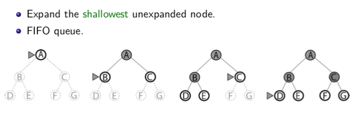
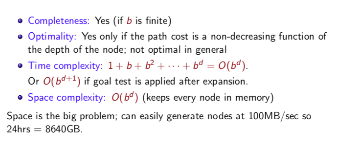

# 3-3 BFS 廣度優先搜尋

每次展開，就把所有的branch 紀錄進frontier裡，再從這層的最左邊node往下一層搜尋。用FIFO queue來紀錄friontier。（推薦自己trace一次queue的紀錄，畫一個排隊隊伍）

### Properties

- Completness :因為每次都會紀錄某層的所有branch, 假如 b無限大，那goal永遠都不會被搜到。
- Optimality: 通常是不會。但當path cost跟depth是正相關時，就會是optimal，因為DFS是依序一層一層往下展開的。
- Time: 第一層 b個 node, 第二層 b^2個node…….第d層 b^d個node