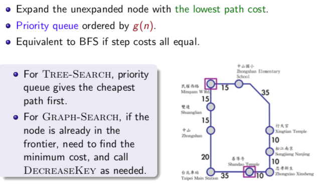
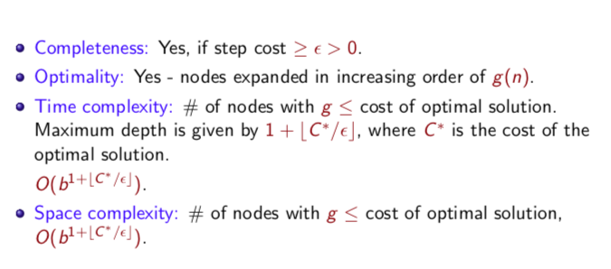

# 3-4 Uniform-cost search

[註]: 等到把node 從frontier拿出來展開時才做goal test的原因，就是這樣才能找到optimal（從所有可能中挑出cost最低的）

### 實作

在Graph search中，priority queue有一個func 叫” DECREASEKEY“，即使是重複的node, 會把原本的node替換成cost較低的那個

### Properties

- 如果有cost == 0, 那每次挑的時候一定都會挑cost==0的node展開，那永遠沒辦法找到goal。
- 一定可以找到optimal,因為我們每次都是挑最小cost的來展開。
- 深度= 總cost / step cost + 1