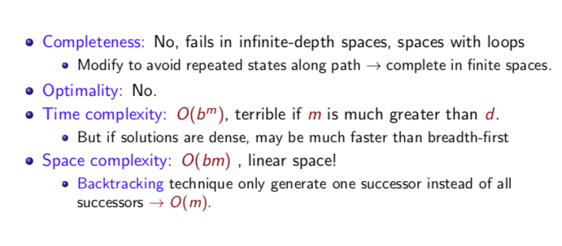
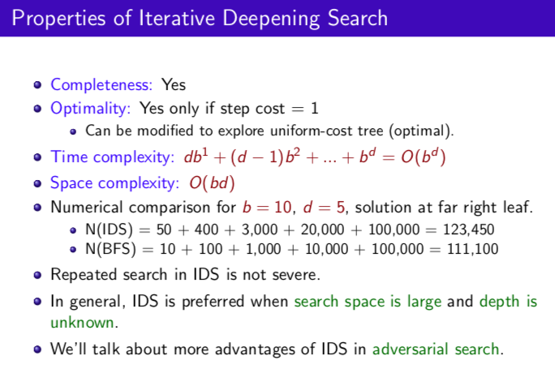

# 3-5 DFS: 深度優先搜尋/ DIS/IDS

### 缺點

 不complete, 不optimal, time 複雜度很差

### 優點

不佔空間!!!!!!! Space 複雜度很好

### 實作

用stack (畫一個杯子)

### Properties

- (m是最深的深度)

## **Depth-limited search**

改進： 限制搜尋深度 -> Depth-limited search

## **iterative-deepening search**

萬一goal在限制之外呢？就查不到了 -> **iterative-deepening search** 逐次放寬限制

內部還是用DFS, 因為space complicity好。

### Properties

直覺上可能會覺得，一層一層拓展，那上層的就要做很多次，不是很浪費時間嗎？但其實跟BFS比起來也沒真的多花太多時間，大約是 b+1/b的差別而已（ex: BFS 10秒, IDS 11秒），卻可以大大省下記憶體，還不錯啦！