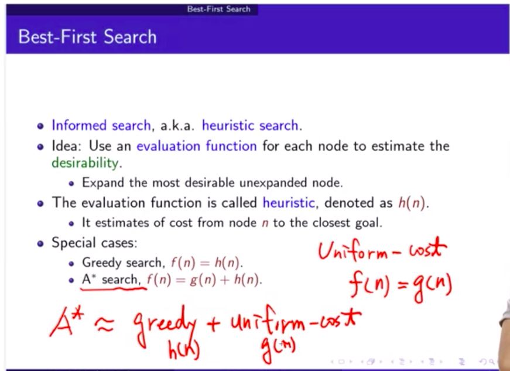
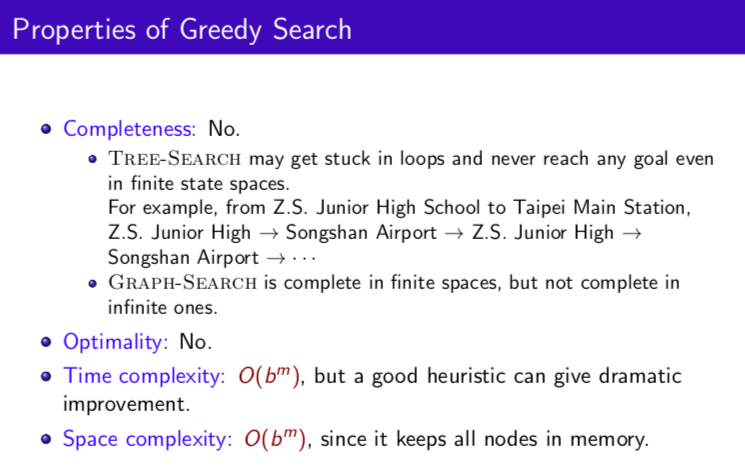
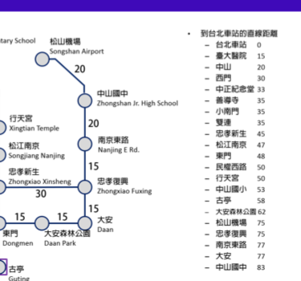

# 3-8 Best-first search- Greedy search

選當下最好的

- Greedy search
- A* search

f(n): 每個節點依據的func

h(n): 激勵函數

g(n): path cost

前面提到的uniform cost，是每一步考慮path cost, 其實就是g(n)

所以A* = greedy + uniform cost

### Example

上面捷運的例子中， 把與北車的直線距離當作h(n)

### Properties

沒有completeness:例如從中山國中開始，要去北車，但是因為松山機場的h(n)= 75 < 南京東路(77)，所以會選擇往松山機場，可是再來就沒路了，只會返回中山國中，進到無窮loop裡面。

如果用Graph, 紀錄拜訪過的點，可能會好一點，但仍有可能發生無窮迴圈的情況。

- 影響Time/space 複雜度的重要因素：一個好的激勵函數h(n)。