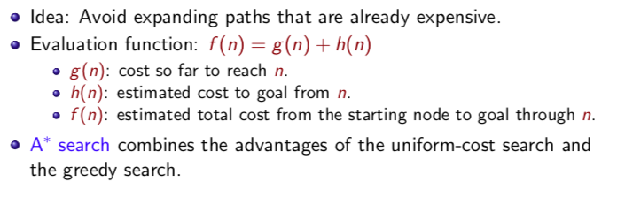
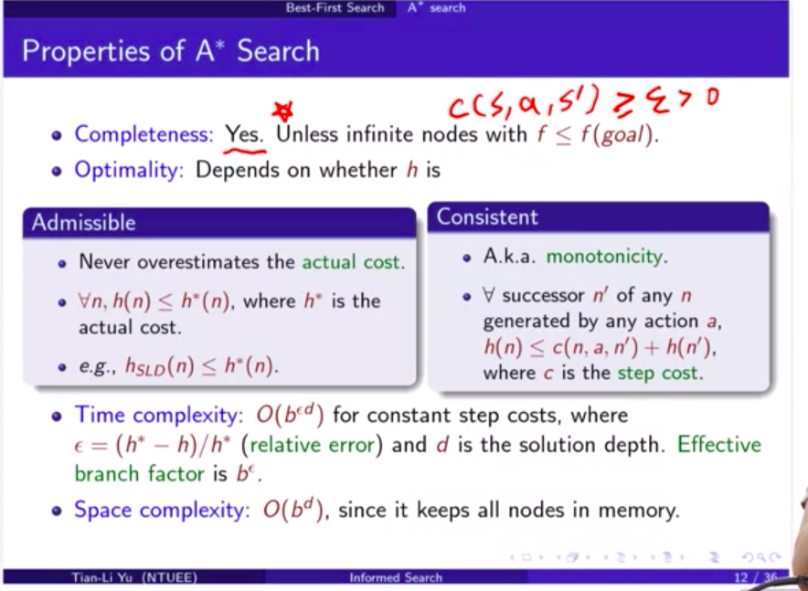
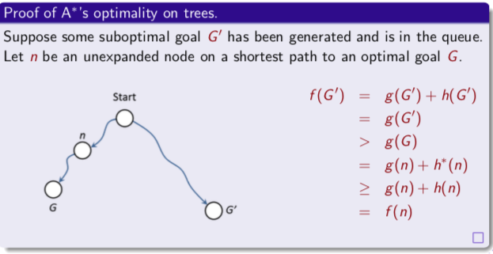
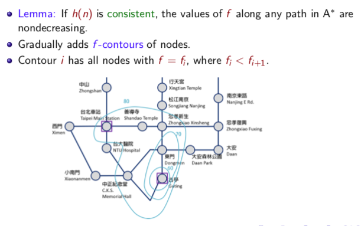
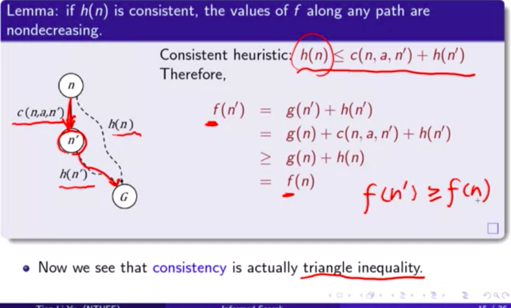
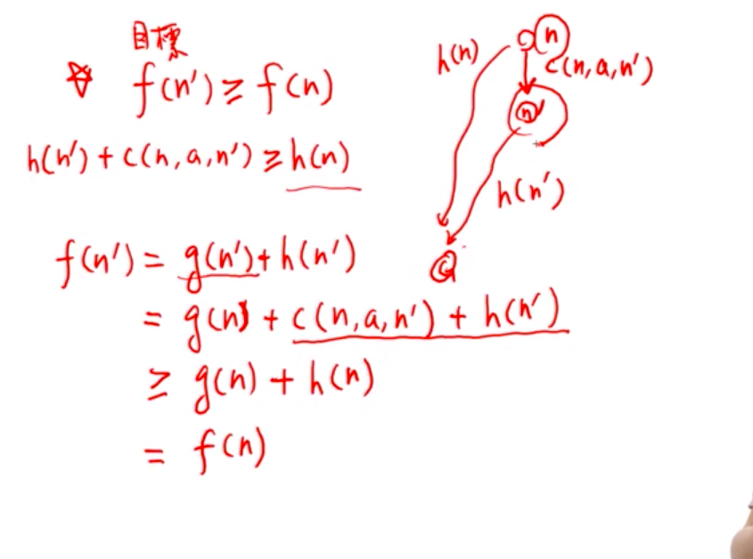

# 3-9 Best first search- A* search

F(n)將代表從起點經過state n 到 goal 的總path coast。

### Properities

- Completeness: 通常會，除非有無限多的nodes, 他的f 都比goal f還小。但這個條件很容易達成，只要 step cost > 0
- 時間複雜度：

    h* = 完美估計的激勵函數，也可以理解成從init到goal實際上花的cost。

    如果h = h*, 代表h真的完美估計，那є = 0, 時間複雜度接近constant。

    反之，如果h = 0, 代表激勵函數完全沒用，則時間複雜度退化回 O(b^d)。

- 空間複雜度：推導過程中可以看到frontier 要紀錄的node越來越多，所以也會佔記憶體。
- 對optimal 的討論：
    1. A* is optimal on trees if h is admissible.	#如果是tree只要符合admissible
    2. A* is optimal on graphs if h is admissible and consistent. #如果是Graph，不只admissible還要consistent

- Admissible: h 永遠不高估，亦即 h < = h*
- Consistent: 三角不等式。在目前state 的 h < 往下一步的step cost + 下一步的 h

但這兩個條件，都是充分但不必要的。

意思是如果符合條件，那一定可以找到optimal

假如不符合，還是有可能找到optimal,只是沒辦法保證。

### 對admissible 的證明：

- 假設不會有多條path通往同一個goal。假設有通往同一個goal, 他會被視為不同的goal。
- n是路徑上經過的某一個node
- G’ 是sub-optimal goal, 也就是第二好的answer。

### 對consistent 的證明：

只要Lemma成立，就可以保證optimal。

就像等高線一樣，例如是80的等高線，那範圍以內，< 80的都一定會被造訪過。在等高線外，f只會越來越大，不可能 < 80

